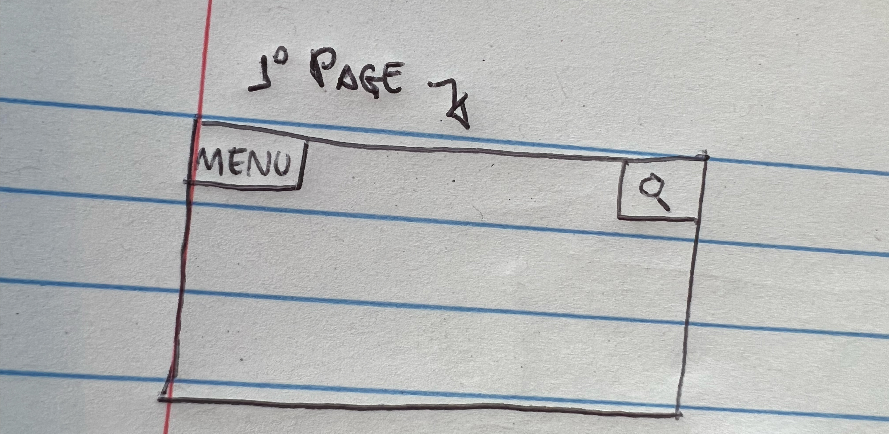
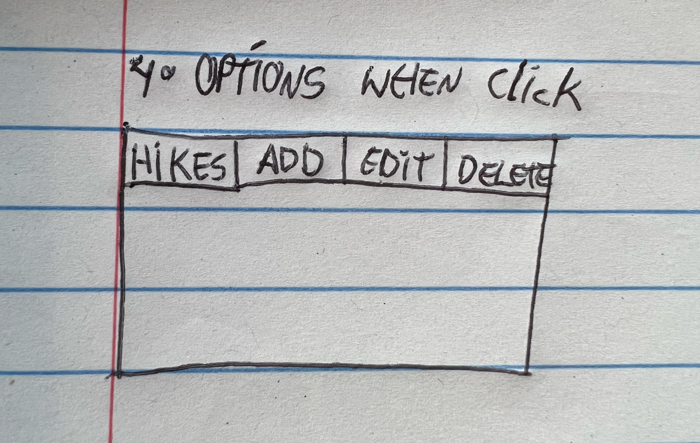
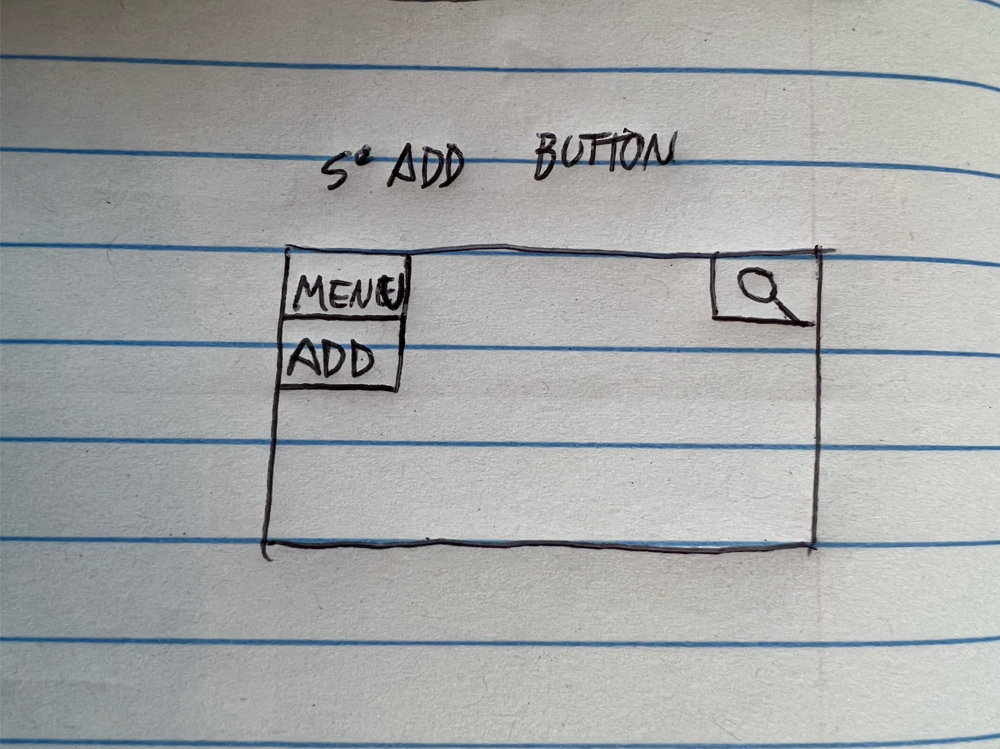
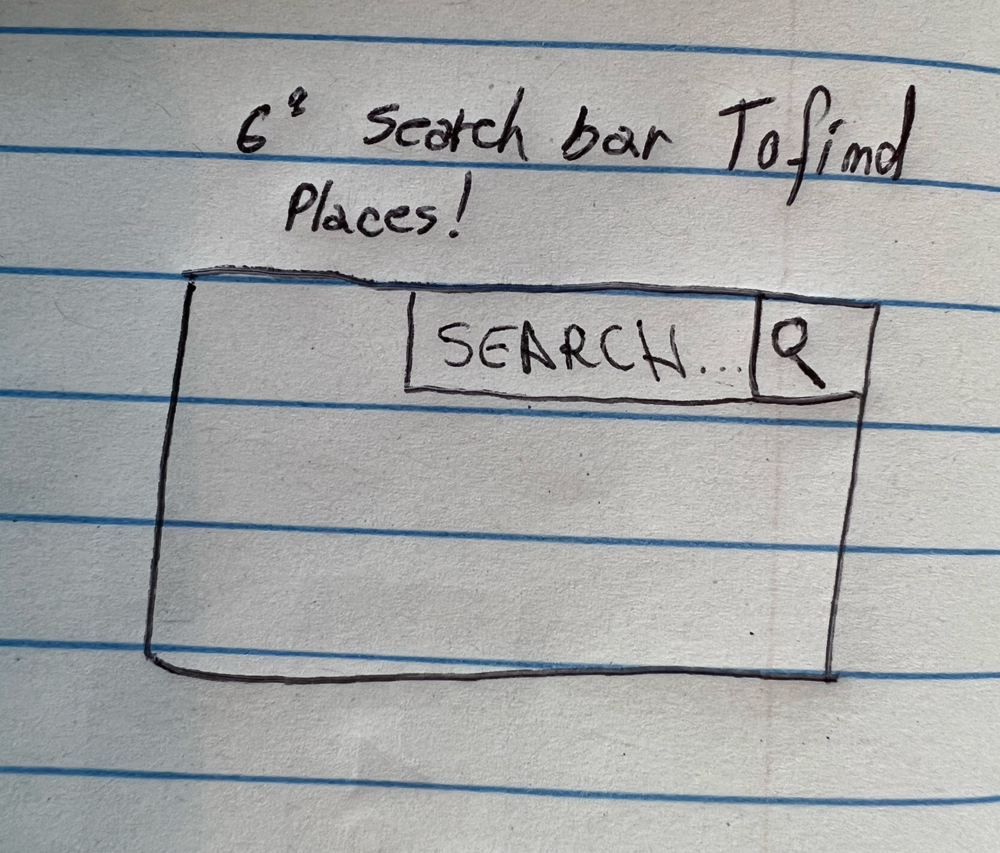
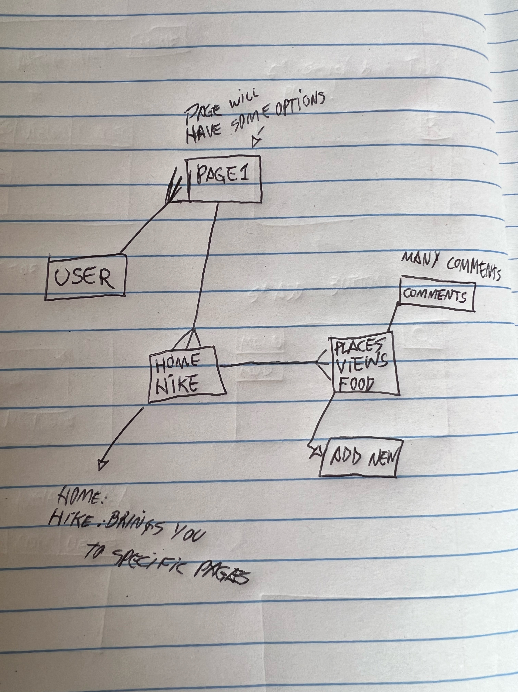
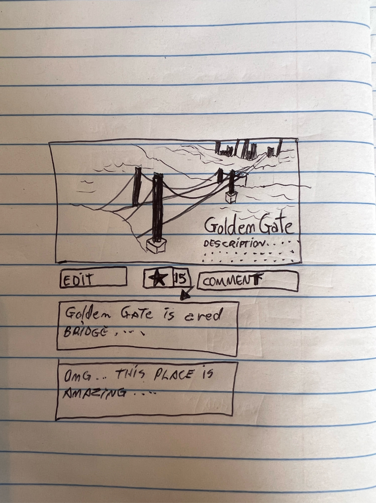

# Project2_GA_TouristGuide
Second Project made on Unit2 GA

Page1:
- This page will hold all the posts
- Show Button Home and Searchbar

Page4:
- When click in some options ex:HIKE, it will show all the hike spots
- It will show the comment below that specific spot

Page5:
- Maybe can be a Add/Edit post

Page6:
- SearchBAr
    - In htis part , will need to have access to all the array holding the posts and filter the name/description

Page Showing post:
- Show picture of the places
- Name of the place and Description

///////////////////////////////////
////////-----------------////////////////////
////////////////////////////////////

-------------------PLANNING--------------
MOdels/Seeds:
|  name     |  String   |
|  address  |  String   |
|  free     |  Boolean  |

----------------------------------------------
Models/Places:
|   name     | String   |
|   address  | String   |
|   free     | Boolean  |

----------------------------------------------

Model/User.js
 username: {
    |    type      |  String  |
    |   required  |  Boolean   |  
    |   unique    |  Boolean    |
   
    password:
    |   type      | String  |
    |   required  | Boolean    |

---------------------------------------------------

